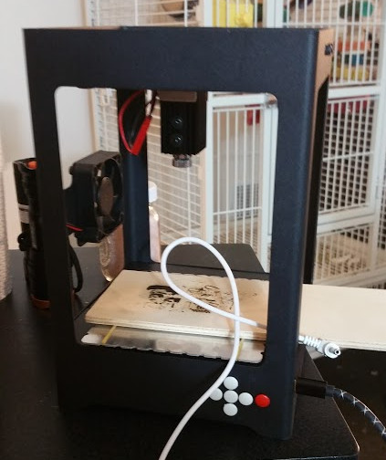
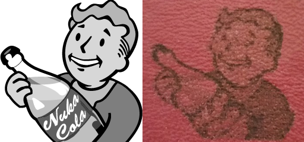
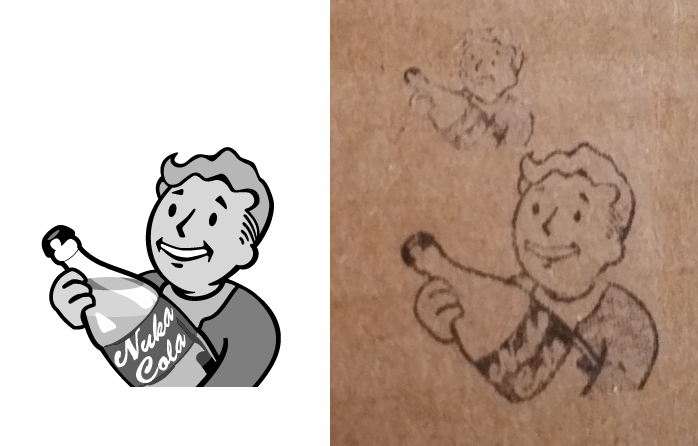
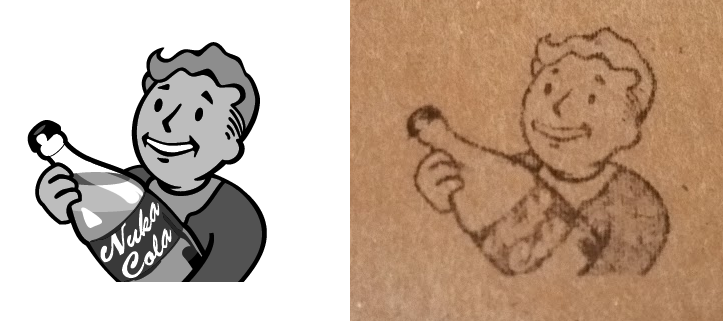
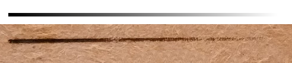
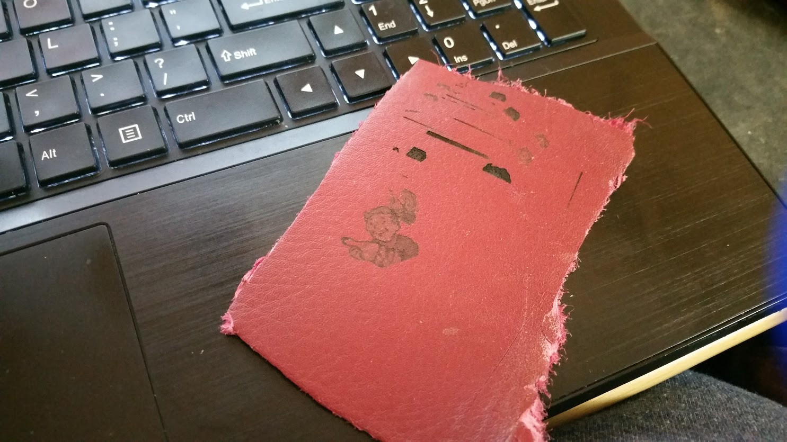

# pyLaser
###### By AppliedEllipsis
Python Interface for  HTPOW (Cheap Chinese CNC Laser Engravers)

Right now, I'm still prototyping and writing this, the code will be cleaner in the near future.

**[Todo](https://github.com/AppliedEllipsis/pyLaser/blob/master/Todo.md)**

**[License](https://github.com/AppliedEllipsis/pyLaser/blob/master/LICENSE.txt)**

**[Source](https://github.com/AppliedEllipsis/pyLaser/blob/master/pyLaser.py)**

**Hardware**
* The laser this is developed against is a [cheap sub-$100, shipped, cnc 1000mw laser from China](https://www.wish.com/c/5852c8be0124c76a0a276aec).
* The laser enclosure is unbranded
* It is listed as HW V2, Firmware V2.4
* The software it uses is HTOPW.
  * I am not a big fan of this software as it seems to only do raster stuff, and isn't the most user friendly, but it is functional.
  * It also goes by the name of SuperCarver (software and laser engraver)
* It looks identical to some cheap chinese NEJE Lasers, but the protocol seems to be different
* Mine came with a bad power supply and EU converter, so I just use a USB power cable and connect it to a 2.4amp power source or powerbank (not very stable, as it seems to go into standby mode with the power bank)

**How to Sniff traffic**
I used a freeware Serial Port Debugger called [SUDT AccessPort](http://www.sudt.com/en/ap/index.html), and would set it to listen to traffic on the com port of the laser, run a task, and save the output.  I would then sanitize the output using some regular expression replaces and look for patterns and trends in the data. A [parser](https://github.com/AppliedEllipsis/pyLaser/blob/master/parseAccessPort.py) was written to process and analyze the dumps easier.  Another [tool](https://github.com/AppliedEllipsis/pyLaser/blob/master/parseGrey2.py) was created to further process the grey data from samples. Run it against the output of the previous script and it will show coords and grey levels in int values.

######Greyscale
* I finally got greyscale to work
* See the results of a sample image (Nuke Cola and Fallout Boy from Fallout)

Leather shows some good contrast at darker levels.  This was done with 20ms speed.

Below is on cardboard. 60ms

Tweaked the source image and tried again... Greyscale is not super impressive on this cardboard material. 60ms

Some materials show grey better than others. It also depends on laser focus.  The test cardboard provided seems to work the best.

Leather shows some good contrast at darker levels.  This was done with 40ms speed.

Leather shows some good contrast at darker levels.  This was done with 60ms speed.

#####Notice
* I thought I screwed up my device when playing with the raster images, it was just I sent some cmds that changed speed to 0 and write speed to 99+
 * If you experience the device not moving or responding after resetting/calibrating and power cycling it, send new motor speed and write speed cmds to it to fix it.

#####Notice
* The Nuke Cola Fallout Boy image came from the Internet is only used as a sample image to test against.  
* I have no affiluation with the creator of the image or the Fallout game/concept/etc.
* This does not represent their ideas, concepts, etc... I just picked it randomly as a sample image.

The leather greyscale looks better from a distance.  Ignore all the other sample etchings, I was using this material to find an optimial cutting speed or contrast of the source image.
Actually don't ignore the sample etchings... look at them to see test results, even though you don't know the timing.
